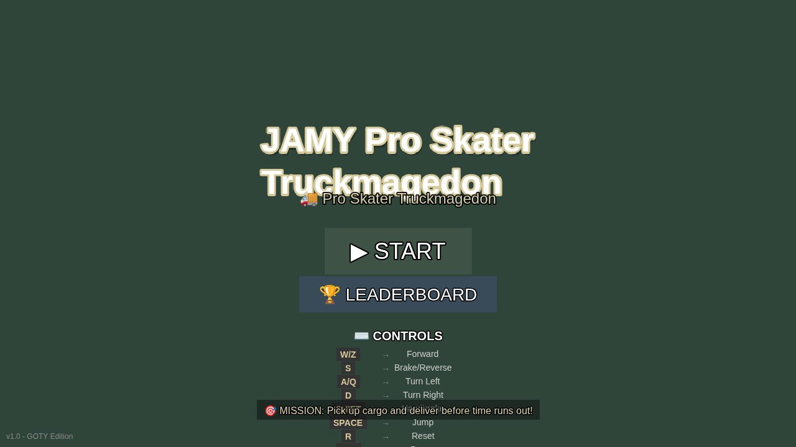

# JAMY Pro Skater Truckmagedon

Un jeu de conduite de camion en vue de dessus avec style pixel art pour navigateurs web. Conduisez un camion de style américain, récupérez des marchandises et livrez-les avant que le temps ne soit écoulé !


## Captures d'écran

<p align="center">
  
  <br>
  <em>Menu Principal - Commencez votre aventure de camionneur !</em>
</p>

## ⚠️ IMPORTANT : Comment lancer le jeu

**N'ouvrez PAS `index.html` directement dans votre navigateur !** Cela résultera en un écran blanc et des erreurs CORS.

Ce jeu utilise des modules JavaScript modernes qui nécessitent un serveur web. Vous DEVEZ utiliser l'une de ces méthodes :

### Méthode 1 : Serveur de développement (Recommandé)
```bash
npm install
npm run gen-assets
npm run dev
```
Le jeu s'ouvrira automatiquement à `http://localhost:3000`

### Méthode 2 : Build de production
```bash
npm install
npm run gen-assets
npm run build
npm run preview
```

## Fonctionnalités

- 🚚 Physique de conduite de camion arcade en vue de dessus
- 🎮 Contrôles au clavier uniquement
- 🎨 Graphismes pixel art avec rendu nearest neighbor
- 📦 Gameplay basé sur des missions : ramassage et livraison
- ⏱️ Système de score basé sur le temps
- 🎯 Flèche directionnelle pointant vers les objectifs
- 🚧 Obstacles et détection de collision
- 🎪 Mécanique de remorque (système de pivot simulé)

## Démarrage rapide

### Installation

```bash
# Cloner le dépôt
git clone https://github.com/Linkatplug/Jamy.git
cd Jamy

# Installer les dépendances
npm install

# Générer les assets du jeu (sprites)
npm run gen-assets

# Démarrer le serveur de développement
npm run dev
```

Le jeu s'ouvrira automatiquement dans votre navigateur à `http://localhost:3000`.

### Build pour la production

```bash
# Créer un build de production
npm run build

# Prévisualiser le build de production
npm run preview
```

La sortie du build sera dans le répertoire `dist/`.

## Contrôles

| Touche | Action |
|--------|--------|
| **W** ou **Z** | Accélérer |
| **S** | Freiner / Marche arrière |
| **A** ou **Q** | Tourner à gauche |
| **D** | Tourner à droite |
| **SHIFT** | Frein à main (frein d'urgence) |
| **ESPACE** | Sauter (passer au-dessus des obstacles) |
| **R** | Réinitialiser la position du camion |
| **ESC** | Pause / Reprendre le jeu |

## Gameplay

### Objectif
Récupérez la marchandise dans la zone verte et livrez-la dans la zone rouge avant que le temps ne soit écoulé !

### Score
- **Bonus de temps** : Les livraisons plus rapides rapportent plus de points (10 points par seconde restante)
- **Pénalité de collision** : Chaque collision déduit 50 points
- **Score final** : Bonus de temps - Pénalités de collision

### Conseils
- Utilisez la flèche directionnelle en bas de l'écran pour trouver votre cible
- Évitez les obstacles pour maximiser votre score
- Le camion tourne mieux à vitesse élevée
- Utilisez le frein à main pour les virages serrés
- Surveillez votre compteur de collisions !

## Structure du projet

```
Jamy/
├── public/
│   └── assets/
│       └── sprites/          # Assets de sprites générés
│           ├── truck.png
│           ├── trailer.png
│           └── tiles.png
├── src/
│   ├── main.js              # Bootstrap du jeu
│   ├── styles/
│   │   └── style.css        # Style du jeu
│   └── game/
│       ├── config.js        # Configuration Phaser
│       ├── scenes/          # Scènes du jeu
│       │   ├── BootScene.js     # Chargement des assets
│       │   ├── MenuScene.js     # Menu principal
│       │   ├── GameScene.js     # Gameplay principal
│       │   └── EndScene.js      # Écran de résultats
│       ├── entities/        # Entités du jeu
│       │   ├── Truck.js         # Camion du joueur
│       │   ├── Trailer.js       # Mécanique de remorque
│       │   └── Obstacle.js      # Obstacles statiques
│       ├── systems/         # Systèmes du jeu
│       │   ├── InputSystem.js   # Entrée clavier
│       │   ├── MissionSystem.js # Logique de mission
│       │   ├── UISystem.js      # Affichage HUD
│       │   ├── CameraSystem.js  # Suivi de caméra
│       │   └── AudioSystem.js   # Audio (placeholder)
│       └── utils/           # Utilitaires
│           ├── constants.js     # Constantes du jeu
│           └── math.js          # Helpers mathématiques
├── scripts/
│   └── gen-assets.js        # Script de génération d'assets
├── docs/
│   ├── screenshots/         # Captures d'écran
│   └── architecture.md      # Documentation d'architecture
├── package.json
├── vite.config.js
└── README.md
```

## Personnalisation

### Ajouter vos propres sprites

Le jeu utilise par défaut des sprites placeholder générés automatiquement. Pour utiliser les vôtres :

1. **Sprite de camion** : Remplacez `public/assets/sprites/truck.png` par votre propre camion pixel art 32x32
2. **Sprite de remorque** : Remplacez `public/assets/sprites/trailer.png` par votre propre remorque pixel art 16x48
3. **Tuiles** : Remplacez `public/assets/sprites/tiles.png` par votre propre tileset

**Important** : Maintenez les mêmes dimensions pour un rendu correct du jeu :
- Camion : 32x32 pixels
- Remorque : 16x48 pixels
- Tuiles : Toute taille (actuellement 128x64 pour 4x2 tuiles)

### Modifier les constantes du jeu

Éditez `src/game/utils/constants.js` pour ajuster :
- Physique du camion (accélération, vitesse max, taux de virage)
- Limite de temps de mission
- Paramètres de score
- Dimensions de la carte
- Positions des zones

### Ajouter de nouveaux obstacles

Dans `src/game/scenes/GameScene.js`, ajoutez des positions au tableau `obstaclePositions` dans la méthode `createObstacles()`.

## Déploiement

### GitHub Pages

1. Mettez à jour le chemin de base dans `vite.config.js` si nécessaire :
```javascript
export default defineConfig({
  base: '/Jamy/', // Remplacez par le nom de votre dépôt
  // ...
});
```

2. Buildez le projet :
```bash
npm run build
```

3. Déployez le dossier `dist/` sur GitHub Pages :
```bash
# En utilisant le package gh-pages
npm install -g gh-pages
gh-pages -d dist
```

4. Activez GitHub Pages dans les paramètres du dépôt en pointant vers la branche `gh-pages`

### Autres hébergements

Téléchargez simplement le contenu du dossier `dist/` sur n'importe quel service d'hébergement statique :
- Netlify
- Vercel
- AWS S3
- Firebase Hosting
- etc.

## Stack technologique

- **Moteur de jeu** : [Phaser 3](https://phaser.io/) - Framework de jeu HTML5
- **Outil de build** : [Vite](https://vitejs.dev/) - Outil de build rapide et serveur de dev
- **Langage** : JavaScript (Modules ES)
- **Génération d'assets** : API Canvas Node.js

## Développement

### Scripts NPM

- `npm run dev` - Démarrer le serveur de développement avec rechargement à chaud
- `npm run build` - Créer un build de production
- `npm run preview` - Prévisualiser le build de production localement
- `npm run gen-assets` - Générer les sprites placeholder

### Ajout de fonctionnalités

Voir [docs/architecture.md](docs/architecture.md) pour des informations détaillées sur l'architecture du jeu et comment l'étendre.

## Support navigateur

Le jeu fonctionne dans tous les navigateurs modernes qui supportent :
- Modules ES6
- API Canvas
- WebGL (pour Phaser 3)

Testé sur :
- Chrome 90+
- Firefox 88+
- Safari 14+
- Edge 90+

## Dépannage

### Écran blanc / Erreur CORS

**Problème** : Ouvrir `index.html` directement affiche un écran blanc ou une erreur CORS :
```
Cross-Origin Request blocked: The Same Origin Policy disallows reading the remote resource at file:///src/main.js
```

**Solution** : Vous ne pouvez pas ouvrir le fichier HTML directement. Utilisez le serveur de développement :
```bash
npm run dev
```

**Pourquoi** : Les navigateurs modernes bloquent les imports de modules ES6 depuis le protocole `file://` pour des raisons de sécurité. Le jeu nécessite un serveur HTTP pour fonctionner.

### Le jeu ne démarre pas après npm run dev

**Problème** : Le navigateur s'ouvre mais affiche une erreur.

**Solutions** :
1. Assurez-vous d'avoir exécuté `npm install` d'abord
2. Générez les assets : `npm run gen-assets`
3. Vérifiez que le port 3000 n'est pas déjà utilisé
4. Essayez de vider le cache de votre navigateur (Ctrl+Shift+Suppr)

### Les assets ne se chargent pas

**Problème** : Les sprites ou images n'apparaissent pas.

**Solution** : Exécutez le script de génération d'assets :
```bash
npm run gen-assets
```

Le jeu inclut une génération de texture de secours, donc il devrait fonctionner même sans les fichiers de sprites.

### Node.js n'est pas installé

**Problème** : Les commandes ne fonctionnent pas ou affichent "command not found".

**Solution** : Installez Node.js depuis [nodejs.org](https://nodejs.org) (version LTS recommandée).

## Licence

Licence MIT - voir le fichier LICENSE pour les détails

## Crédits

Créé comme démonstration de jeu de conduite de camion en pixel art utilisant Phaser 3.

## Support

Pour les problèmes, questions ou contributions, veuillez visiter le [dépôt GitHub](https://github.com/Linkatplug/Jamy).

## Roadmap

Améliorations futures potentielles :
- [ ] Missions multiples avec difficulté croissante
- [ ] Différents types de camions
- [ ] Effets météo
- [ ] Cycle jour/nuit
- [ ] Cartes plus détaillées
- [ ] Mode multijoueur
- [ ] Contrôles tactiles mobiles
- [ ] Effets sonores et musique
- [ ] Système d'achievements
- [ ] Classements

---

**Profitez du jeu ! 🚚💨**
